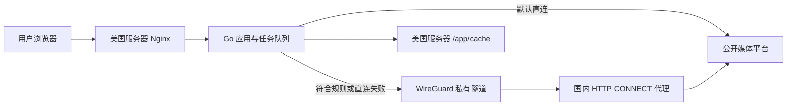

# Video Collector 国内临时出口代理实施与验收任务书

> 文档状态：本地实现、自动化测试、镜像发布和生产默认关闭上线完成；国内网络 PoC 与生产启用待完成
> 创建日期：2026-07-26
> 当前生产服务器：`47.251.87.147`
> 当前正式地址：`https://video-collector.ximoai.cn`
> 国内服务器角色：仅作为无缓存、受控的临时网络出口，不运行本项目

## 1. 目标

在不迁移、不复制现有 Video Collector 服务的前提下，为受美国服务器出口 IP 或地域限制影响的公开媒体站点增加一个国内临时出口。

实施后的行为必须是：

1. 浏览器、Nginx、Go API、任务队列、yt-dlp、FFmpeg、Whisper、缓存和下载文件仍运行或保存在 `47.251.87.147`。
2. 默认继续由美国服务器直接访问媒体平台。
3. 只有命中受控域名规则，或直连出现可确认的 IP/地域类错误时，才尝试国内出口。
4. 国内服务器只转发网络流量，不运行前端、API、任务队列、yt-dlp、FFmpeg 或 Whisper，不保存媒体文件。
5. 不引入登录、Cookie、账号、验证码、DRM、付费墙或权限绕过能力。
6. 原有未下载 30 分钟、首次下载后 15 分钟清理策略完全不变。

## 2. 固定约束

- 唯一生产应用服务器仍为 `47.251.87.147`。
- 唯一正式网址仍为 `https://video-collector.ximoai.cn`。
- 国内服务器不是第二套生产环境，不对外提供 Video Collector 网站或 API。
- 国内服务器不得成为公网开放代理。
- 主站 `D:\sub2api中转站` 继续只读，不在本任务中修改。
- 项目产生的缓存继续只允许写入项目根 `cache` 映射的 `/app/cache`。
- 代理故障不得影响非受限站点的直接解析和下载。
- 不通过伪造地区请求头、公开代理池、住宅代理、Cookie 或账号规避平台限制。
- 所有真实验收样本必须是无需登录、无需 Cookie、无 DRM 且允许公开访问的页面。

## 3. 明确不做

- 不迁移正式域名、证书、Nginx 或数据库。
- 不在国内服务器运行本项目容器或保存项目任务状态。
- 不把用户下载文件先保存到国内服务器。
- 不自动搜索、购买或轮换第三方代理 IP。
- 不为用户提供手动填写代理地址的前端入口。
- 不对所有站点强制使用国内出口。
- 不在国内代理进行 TLS 解密、SSL Bump 或证书替换。
- 不声称代理可以解决登录、Cookie、DRM、CAPTCHA、内容删除或解析器不兼容。

## 4. 实施前必须由用户提供的信息

在以下信息未确认前，只允许编写本地代码和测试，不允许连接或修改国内服务器：

- [ ] 国内服务器公网 IPv4。
- [ ] 操作系统、版本和 CPU 架构。
- [ ] 云服务商及安全组控制方式。
- [ ] SSH 管理方式和授权窗口。
- [ ] 可用公网带宽、月流量和计费方式。
- [ ] UDP 是否可用；如可用，允许的 WireGuard UDP 端口。
- [ ] 国内服务器是否已有防火墙、代理、VPN 或端口占用。
- [ ] 需要优先验证的两个公开国内平台链接。
- [ ] 云服务商和目标平台规则允许该服务器作为私有服务器间出口。

## 5. 当前代码基线

截至 2026-07-26，本地实现已经具备：

- `server/internal/videocollector/egress.go` 提供受控域名规则、一次出口切换、路由 TTL、熔断和单半开探测。
- 单条解析、集合、视频、MP3、字幕、URL 转录输入和图片 HTTP 请求均支持任务级 `direct`/`cn_proxy` 决策。
- 图片请求保留应用层 URL、DNS 和重定向公网校验，并通过受信 HTTP CONNECT 代理传输 HTTPS。
- 配置只从服务端环境读取；客户端 API 和前端没有代理选择器。
- 默认模式为 `off`，没有设置容器级 `HTTP_PROXY`、`HTTPS_PROXY` 或 `ALL_PROXY`。
- `/health` 只增加高层 `egressStatus`，不会返回代理地址、密钥或域名清单。
- `.env.example`、Compose、生产部署文档和无密钥 WireGuard/Squid 模板已经同步。

本地 Go、前端、Linux race、完整生产镜像和 AcFun 直连下载回归已通过。提交 `7c8f1cd` 已发布并以 `VIDEO_COLLECTOR_EGRESS_MODE=off` 部署到正式站点，`/health` 返回 `egressStatus=off`；国内服务器信息、WireGuard/Squid 真实 PoC 和两个国内平台验收尚未提供或执行。

## 6. 目标架构



### 6.1 美国服务器继续负责

- HTTPS 网站和同源 API。
- 匿名 IP 限流、全局并发和有界队列。
- URL 安全校验、路由选择和错误分类。
- yt-dlp、FFmpeg、ffprobe 和 Whisper。
- 下载进度、取消和临时文件清理。
- 所有媒体、图片、字幕和转录结果的临时保存。

### 6.2 国内服务器只负责

- WireGuard 对等端。
- 仅监听 WireGuard 地址的 HTTP CONNECT 代理。
- 目标端口、目标地址和来源地址 ACL。
- NAT 公网出口。
- 最小化的健康、连接数和流量指标。

国内服务器不得挂载项目目录，不得运行项目镜像，不得配置媒体缓存目录。

## 7. 网络方案

### 7.1 推荐组件

- 隧道：WireGuard。
- 代理：支持 HTTP CONNECT、来源 ACL、目标 ACL 和禁用缓存的受维护代理服务；首选操作系统稳定仓库中的 Squid 6/7。
- WireGuard 和代理都由 systemd 管理。

使用 HTTP CONNECT 的原因：

- yt-dlp 官方支持 HTTP、HTTPS 和 SOCKS 代理。
- FFmpeg 官方支持 `http_proxy`。
- Go `http.Transport` 原生支持 HTTP 代理。
- HTTPS 通过 CONNECT 端到端传输，不需要在国内服务器终止 TLS。

### 7.2 示例地址规划

以下地址仅为文档示例，实施时必须确认不与服务器现有网络冲突：

```text
WireGuard 网段：10.77.0.0/30
美国服务器：   10.77.0.1/30
国内服务器：   10.77.0.2/30
代理监听：     10.77.0.2:3128
WireGuard：    国内服务器公网 IPv4:51820/UDP
```

### 7.3 WireGuard 要求

- 私钥权限必须为 `0600`。
- 国内服务器安全组只向美国服务器公网 IP 开放 WireGuard UDP 端口。
- 代理端口 `3128` 不允许出现在公网安全组中。
- 美国服务器只把 `10.77.0.2/32` 通过 WireGuard 路由，不修改系统默认路由。
- 项目容器通过宿主机路由访问 `10.77.0.2:3128`，不得给项目容器增加 `NET_ADMIN` 或特权模式。
- 如果一端在 NAT 后且需要保持映射，才配置 `PersistentKeepalive = 25`。

### 7.4 国内代理要求

代理必须满足以下顺序化 ACL：

1. 只允许来源 `10.77.0.1/32`。
2. 只允许普通 HTTP 的 80 端口和 CONNECT 的 443 端口。
3. 拒绝 localhost、RFC1918、链路本地、组播、未指定地址和云元数据地址。
4. 拒绝代理自身、WireGuard 网段及云服务商内部网段。
5. 最后一条规则必须是 `deny all`。
6. 禁用对象缓存；不得把响应或媒体写入磁盘缓存。
7. 不启用 SSL Bump，不替换目标证书。
8. 访问日志不得包含完整查询参数；无法可靠脱敏时关闭访问日志，仅保留连接计数和字节数。
9. 设置最大并发、空闲超时、单连接速率和总带宽上限。

Squid 配置必须在启动前通过版本对应的配置检查。至少包含与下列语义等价的规则：

```text
http_access deny !Safe_ports
http_access deny CONNECT !SSL_ports
http_access deny to_localhost
http_access deny to_linklocal
http_access allow us_wireguard_peer
http_access deny all
cache deny all
```

不得直接复制示例后上线；还必须补齐所有私网、元数据、代理自身和云厂商内部地址 ACL。

## 8. 应用路由设计

### 8.1 路由类型

```go
type EgressRoute string

const (
    EgressDirect  EgressRoute = "direct"
    EgressCNProxy EgressRoute = "cn_proxy"
)
```

路由只存在于服务端，不加入浏览器请求参数，客户端不能指定代理。

### 8.2 路由模式

只实现两个运维模式：

- `off`：完全关闭国内出口，保持当前直接访问行为。
- `auto`：使用域名策略、错误分类、路由缓存和熔断自动选择。

不实现全局 `proxy-only`，避免国内代理故障导致所有平台不可用。

### 8.3 候选路由顺序

| 场景 | 第一次 | 第二次 | 说明 |
|---|---|---|---|
| 未列入国内规则的站点 | direct | 无 | 保持当前行为 |
| 已确认受地域限制的站点，缓存未命中 | direct | cn_proxy | 首次用真实失败建立证据 |
| 最近通过国内出口成功的源站主机 | cn_proxy | direct | 路由缓存有效期内减少重复失败 |
| 国内代理熔断期间 | direct | 无 | 代理快速失败不得拖垮任务队列 |
| 明确非代理类错误 | direct | 无 | 登录、DRM、404 等不回退 |

路由缓存按规范化后的源页面主机名保存，不按用户、完整 URL 或查询参数保存。默认 TTL 建议 30 分钟。

### 8.4 一个任务必须固定出口

同一个逻辑尝试中的以下请求必须固定为同一路由：

- yt-dlp 页面解析和附加接口请求。
- 格式列表和签名 URL 获取。
- 视频、音频、分片、字幕和 URL 转录输入下载。
- yt-dlp 调用的外部下载器。
- 同一图片任务中的源页面重新解析和图片获取。

如果从 direct 切换到 cn_proxy：

- 必须终止当前子进程。
- 删除该任务尝试产生的 `.part` 和不完整文件。
- 从零开始代理尝试，不跨出口续传。
- 整个切换仍计为一个用户任务和一个限流配额。

## 9. 自动识别与失败分类

### 9.1 可以触发代理回退

以下信号只有在源主机属于受控国内域名规则时才允许触发一次代理回退：

- HTTP 403、408、412、429、451。
- 连接超时、连接重置、远端提前关闭。
- 明确的地区不可用、区域限制或出口 IP 拒绝信息。
- 同一域名的直接路由近期连续失败且国内路由近期成功。

403 和 429 不一定是地域限制，因此最多回退一次，不得循环切换出口。

### 9.2 不允许代理回退

- HTTP 400、401、404。
- 需要登录、Cookie、账号、年龄确认或验证码。
- DRM、付费墙、会员内容或私有内容。
- 不支持的 URL、解析器缺失或页面已删除。
- 用户输入不安全、DNS 解析到非公网地址或 URL 校验失败。
- 输出目录、格式 ID、字幕语言或资源 ID 校验失败。

### 9.3 熔断策略

- 国内代理连续 3 次连接或 CONNECT 失败后打开熔断器。
- 默认熔断 60 秒。
- 熔断期间不再向国内代理发送新任务。
- 期满后只允许一个半开探测任务。
- 探测成功关闭熔断器；失败重新进入熔断。
- 熔断状态只存内存，应用重启后从健康未知状态开始。

不得运行持续抓取平台页面的后台探测器。健康判断优先使用代理 TCP/CONNECT 可达性和真实用户任务结果。

## 10. 新增配置

建议新增以下环境变量：

| 变量 | 默认值 | 约束 |
|---|---|---|
| `VIDEO_COLLECTOR_EGRESS_MODE` | `off` | 仅允许 `off`、`auto` |
| `VIDEO_COLLECTOR_CN_PROXY_URL` | 空 | 仅允许 `http://`，目标必须是配置的 WireGuard 地址 |
| `VIDEO_COLLECTOR_CN_PROXY_SOURCE_HOSTS` | 空 | 逗号分隔的源页面主机或后缀规则 |
| `VIDEO_COLLECTOR_CN_PROXY_ROUTE_TTL_SECONDS` | `1800` | 建议 60–3600 |
| `VIDEO_COLLECTOR_CN_PROXY_CONNECT_TIMEOUT_SECONDS` | `5` | 建议 1–15 |
| `VIDEO_COLLECTOR_CN_PROXY_BREAKER_FAILURES` | `3` | 建议 1–10 |
| `VIDEO_COLLECTOR_CN_PROXY_BREAKER_SECONDS` | `60` | 建议 10–600 |

生产示例只在网络 PoC 通过后填写：

```dotenv
VIDEO_COLLECTOR_EGRESS_MODE=auto
VIDEO_COLLECTOR_CN_PROXY_URL=http://10.77.0.2:3128
VIDEO_COLLECTOR_CN_PROXY_SOURCE_HOSTS=bilibili.com,b23.tv
VIDEO_COLLECTOR_CN_PROXY_ROUTE_TTL_SECONDS=1800
VIDEO_COLLECTOR_CN_PROXY_CONNECT_TIMEOUT_SECONDS=5
VIDEO_COLLECTOR_CN_PROXY_BREAKER_FAILURES=3
VIDEO_COLLECTOR_CN_PROXY_BREAKER_SECONDS=60
```

代理 URL 不得包含用户从网页提交的内容。使用 WireGuard 来源 ACL 后，默认不在命令行代理 URL中携带密码，避免凭据出现在进程列表。

## 11. 代码改造任务

### 11.1 配置与模型

- [x] 先为全部新配置编写表驱动测试。
- [x] 在 `server/cmd/video-collector/main.go` 增加严格配置解析。
- [x] 非法模式、协议、端口、主机规则和数值必须导致启动失败。
- [x] `off` 模式不得要求代理 URL。
- [x] `auto` 模式缺少代理 URL 或源主机规则时必须拒绝启动。
- [x] 新增 `EgressRoute`、`EgressDecision` 和内部失败分类类型。

### 11.2 路由选择器

- [x] 新建最小 `EgressRouter`，不引入数据库或外部分布式缓存。
- [x] 支持规范化主机规则、候选路由顺序和 TTL 缓存。
- [x] 支持熔断、半开探测和并发安全。
- [x] 不保存完整 URL、用户 IP、标题或媒体元数据。
- [x] 一个任务最多进行一次出口切换。

### 11.3 yt-dlp

- [x] 为 `Parse` 添加 direct/cn_proxy 候选尝试。
- [x] 为 `ParseCollection` 添加相同路由行为。
- [x] 为视频、MP3 和字幕下载添加任务级 `--proxy`。
- [x] 为 URL 转录输入下载添加任务级 `--proxy`。
- [x] direct 路由不得出现 `--proxy` 参数。
- [x] cn_proxy 路由必须且只能出现一次 `--proxy` 参数。
- [x] 不使用 `--geo-verification-proxy` 代替实际下载代理。
- [x] 路由切换前清理本次尝试的不完整文件。

### 11.4 FFmpeg

- [x] 已确认当前真实流程中 FFmpeg 只处理 yt-dlp 下载后的本地文件，不自行请求远程 URL。
- [x] 当前不存在 FFmpeg 远程输入，因此不注入 `http_proxy`；未来增加远程输入时必须按任务传入。
- [x] 本地转码、合并和 Whisper 预处理不得使用代理。
- [x] 不设置容器级全局 `HTTP_PROXY` 或 `HTTPS_PROXY`。

### 11.5 图片下载

- [x] 将 `newSafeHTTPClient` 改为显式接收任务路由。
- [x] direct 使用当前安全直连 DialContext。
- [x] cn_proxy 使用受信配置的 HTTP CONNECT 代理。
- [x] 初始 URL 和每次重定向仍执行协议、主机和公网地址检查。
- [ ] 国内代理同时拒绝目标私网地址，解决代理端 DNS 与美国端 DNS 不一致的问题。
- [x] 保留 50 MiB 图片大小限制和可信资源 ID机制。

### 11.6 API、前端和健康信息

- [x] 不增加前端代理选择器。
- [x] 不改变现有创建任务 API 请求结构。
- [x] `/health` 只允许返回 `off`、`available`、`degraded`、`unavailable` 等高层状态。
- [x] `/health` 不得返回代理 URL、WireGuard 地址、密钥或域名清单。
- [x] 用户错误可说明“直接出口与备用出口均失败”，但不得暴露内部网络信息。

## 12. SSRF 与信任边界

代理接入后必须同时保留两层防护：

### 美国应用层

- 继续拒绝非 HTTP/HTTPS、URL 凭据、localhost、私网、链路本地、组播和云元数据地址。
- 继续校验用户初始 URL 和 Go HTTP 客户端每次重定向。
- 代理配置只能从服务器环境读取，不能来自 API 请求。
- 只允许固定的 WireGuard 代理地址。

### 国内代理层

- 独立解析每一个 CONNECT 或 HTTP 目标。
- 拒绝解析到任何非公网 IP 的目标。
- 拒绝代理自身、WireGuard 网段和云厂商内部地址。
- 拒绝 80/443 以外端口。
- 最终默认拒绝全部未明确允许的请求。

原因：yt-dlp 是外部进程，内部重定向不能只依赖 Go 应用首次 DNS 校验；国内代理必须成为第二道强制边界。

## 13. 日志与指标

允许记录：

- 路由类型：`direct` 或 `cn_proxy`。
- 规范化源主机，不含路径或查询参数。
- 失败类别，不含完整命令输出。
- 是否发生回退、熔断状态、耗时和传输字节数。
- 代理连接成功率和并发数。

禁止记录：

- 完整媒体 URL、签名 URL 或查询参数。
- WireGuard 私钥、代理凭据或环境变量。
- Cookie、Authorization、用户上传文件内容。
- yt-dlp 原始输出中可能包含的媒体直链。

## 14. TDD 与自动化测试

### 14.1 配置测试

- [x] `off` 使用当前行为。
- [x] `auto` 缺配置时启动失败。
- [x] 只接受 HTTP 代理和固定 WireGuard 地址。
- [x] 拒绝代理 URL 中的路径、查询参数和片段。
- [x] 主机规则统一小写、去尾点并拒绝空规则。

### 14.2 路由测试

- [x] 未列入规则的主机只直连。
- [x] 可回退错误产生 `direct -> cn_proxy`。
- [x] 非回退错误不访问代理。
- [x] 代理成功后路由缓存生效并在 TTL 后过期。
- [x] 同一任务最多切换一次。
- [x] 熔断、半开和恢复符合配置。
- [x] 并发任务不会产生数据竞争。

### 14.3 命令参数测试

- [x] direct 的解析、集合、下载和转录均无 `--proxy`。
- [x] cn_proxy 均包含唯一、正确的 `--proxy`。
- [x] 代理值不能由媒体 URL 或客户端参数影响。
- [x] 日志和错误中代理地址被脱敏。

### 14.4 HTTP 与 SSRF 测试

- [x] direct 图片下载保持当前公网 DNS 校验。
- [x] cn_proxy 图片下载通过模拟 CONNECT 代理。
- [x] 代理重定向到私网时被拒绝。
- [ ] 代理解析到 `127.0.0.1`、RFC1918、链路本地或元数据地址时被拒绝。
- [x] 50 MiB 上限、MIME 和扩展名校验保持通过。

### 14.5 集成测试

- [x] 模拟 direct 返回 412、cn_proxy 成功。
- [x] 模拟 direct 超时、cn_proxy 成功。
- [x] 模拟 404、登录限制和 DRM 错误时不访问代理。
- [x] 取消发生在 direct 或 cn_proxy 时都能终止进程并清理部分文件。
- [x] 代理断开不阻塞非受限站点。
- [x] 15/30 分钟 TTL 不受路由变化影响。

## 15. 分阶段实施

### 阶段 P0：输入确认

- [ ] 收集第 4 节全部服务器信息。
- [ ] 确认国内服务器带宽成本和平台规则。
- [ ] 选择两个无需登录的真实国内平台测试链接。
- [ ] 为国内服务器创建独立回滚和配置备份目录。

通过条件：没有未知的服务器地址、系统、防火墙、端口或授权信息。

### 阶段 P1：纯网络 PoC，不修改项目

- [ ] 在两台服务器安装并配置 WireGuard。
- [ ] 验证双方只能通过 WireGuard 地址通信。
- [ ] 在国内服务器部署无缓存 HTTP CONNECT 代理。
- [ ] 验证公网无法连接代理端口。
- [ ] 验证美国服务器可通过 `10.77.0.2:3128` 建立 HTTPS CONNECT。
- [ ] 从项目容器内执行 yt-dlp 代理解析测试。
- [ ] 对一个美国直连失败的真实样本完成代理解析和小格式完整下载。
- [ ] 验证国内服务器未生成媒体缓存文件。

停止条件：如果国内云服务器 IP 对目标平台仍返回相同风控，停止代码实施并报告该出口不可用，不通过增加 Cookie、账号或代理池规避。

### 阶段 P2：本地 TDD 实现

- [x] 按第 14 节先添加失败测试。
- [x] 实现配置、路由选择、错误分类和熔断。
- [x] 接入 yt-dlp 和图片 HTTP 客户端。
- [x] 保持所有现有测试通过。
- [x] 运行竞态检查并修复共享路由状态的数据竞争。

通过条件：新增测试全部通过，且现有功能无回归。

### 阶段 P3：完整容器验收

- [x] 构建完整生产镜像。
- [x] 使用测试代理模拟 direct/cn_proxy 行为。
- [x] 验证视频、MP3、图片、字幕和 URL 转录都能固定使用同一路由。
- [x] 验证上传文件转录完全不访问代理。
- [x] 验证批量任务逐条选择路由且不突破并发上限。
- [x] 验证缓存仍只写项目根 `cache`。

### 阶段 P4：安全上线，功能默认关闭

- [x] 提交并推送 GitHub。
- [x] GitHub Actions 前端、Go 和镜像发布全部成功。
- [x] 给当前生产镜像创建回滚标签。
- [x] 在 `47.251.87.147` 拉取新镜像。
- [x] 保持 `VIDEO_COLLECTOR_EGRESS_MODE=off` 启动。
- [x] 验证正式站点、健康检查和现有直连平台无回归。

### 阶段 P5：生产启用与真实验收

- [ ] 写入经过 PoC 验证的代理配置。
- [ ] 切换为 `VIDEO_COLLECTOR_EGRESS_MODE=auto`。
- [ ] 验证代理高层健康状态。
- [ ] 验证 Bilibili 或另一个已确认受限平台可解析。
- [ ] 选择最小可用格式完成浏览器真实下载。
- [ ] 验证另一个国内平台链接。
- [ ] 验证 AcFun、SoundCloud、TED 等现有通过项无回归。
- [ ] 验证页面仍显示 15/30 分钟清理规则。
- [ ] 验证下载后 `X-Delete-At` 约为 15 分钟。
- [ ] 验证国内服务器没有媒体文件或对象缓存。

### 阶段 P6：故障与回滚演练

- [ ] 临时停止国内代理，确认非受限站点继续直连。
- [ ] 确认受限站点快速失败而非占满队列。
- [ ] 验证熔断和恢复。
- [ ] 设置 `VIDEO_COLLECTOR_EGRESS_MODE=off`，确认无需回滚镜像即可关闭功能。
- [ ] 使用回滚镜像恢复一次并重新检查健康状态。

## 16. 验收矩阵

| 编号 | 验收项 | 通过条件 |
|---|---|---|
| CN-01 | 生产位置 | 网站、API、任务、缓存仍只在 `47.251.87.147` |
| CN-02 | 代理隔离 | 公网无法访问代理，只有 WireGuard 美国对等端可访问 |
| CN-03 | 无缓存 | 国内服务器不保存媒体响应或项目文件 |
| CN-04 | 默认直连 | 非规则站点不经过国内出口 |
| CN-05 | 自动回退 | 受控域名 direct 出现可回退错误后只尝试一次 cn_proxy |
| CN-06 | 错误边界 | 登录、Cookie、DRM、404、无效 URL 不触发代理 |
| CN-07 | 路由一致 | 同一尝试中的解析、媒体、字幕、图片和转录输入使用同一路由 |
| CN-08 | SSRF | 美国应用和国内代理均拒绝全部非公网目标与危险端口 |
| CN-09 | 故障隔离 | 国内代理故障不影响海外平台和未列入规则的站点 |
| CN-10 | 任务资源 | 回退仍遵守原有 IP 限流、并发、队列和硬超时 |
| CN-11 | 文件生命周期 | 15/30 分钟清理和活动下载租约保持不变 |
| CN-12 | 浏览器下载 | 代理任务能通过正式网页触发浏览器原生下载 |
| CN-13 | 日志安全 | 日志不含完整 URL、查询参数、Cookie、密钥或代理凭据 |
| CN-14 | 关闭开关 | 设置 `off` 后立即恢复当前纯直连行为 |
| CN-15 | 回滚 | 旧镜像可恢复，正式 HTTPS 和健康检查正常 |

## 17. 回滚方案

优先使用配置回滚：

1. 将 `VIDEO_COLLECTOR_EGRESS_MODE` 改为 `off`。
2. `docker compose up -d --no-build` 重新创建应用容器。
3. 验证 `/health`、正式首页和一个现有直连平台。
4. 保留 WireGuard 和国内代理但不再发送流量，便于排查。

如果新代码本身存在回归：

1. 将 Compose 镜像切回部署前的回滚标签。
2. 启动旧镜像并确认容器 `healthy`。
3. 验证 HTTPS、Nginx、251 MiB 上传限制和嵌入策略未变化。
4. 不删除失败版本日志和验收记录，但不得保留媒体测试文件超过原 TTL。

## 18. 风险

- 国内云服务器 IP 仍可能被平台识别为数据中心出口，代理不保证成功。
- 大视频会产生国内服务器到美国服务器的公网流量和费用。
- 跨境链路延迟会降低下载速度，并增加超时概率。
- 平台可能把页面解析、API、CDN 和分片绑定到同一出口，错误的中途切换会导致签名失效。
- 代理 DNS 与美国 DNS 结果可能不同，必须在国内代理再次做公网地址检查。
- 403、412、429 可能是频率或客户端指纹问题，不一定是地域问题。
- 错误分类过宽会把无关流量送到国内出口；过窄会降低回退成功率。
- 代理成为开放端口会产生严重滥用和费用风险，因此网络隔离是上线阻断项。

## 19. 交付物

- [ ] 国内服务器 WireGuard 配置及脱敏备份说明。
- [ ] 美国服务器 WireGuard 配置及脱敏备份说明。
- [ ] 国内无缓存代理配置和 ACL 验收记录。
- [x] 新增路由、错误分类、熔断和代理客户端代码。
- [x] 单元、集成、竞态和完整构建测试。
- [x] `.env.example`、Compose 和部署文档更新。
- [ ] 两个平台真实生产验收记录。
- [x] 带宽、失败率、回退率和代理健康监控说明。
- [x] 配置关闭和镜像回滚记录。

## 20. 完成定义

只有同时满足以下条件，任务才可以标记为完成：

1. 国内服务器没有运行项目，也没有保存媒体文件。
2. 代理不是公网开放代理，并通过来源、目标和端口 ACL 验收。
3. 一个美国直连失败的公开国内样本通过国内出口完成解析和浏览器下载。
4. 第二个国内平台完成真实解析验证。
5. 现有海外和国内直连通过项无回归。
6. 代理断开不会影响默认直连流量。
7. SSRF、重定向、日志脱敏、限流、并发和 TTL 测试全部通过。
8. GitHub Actions、GHCR、生产容器健康和 HTTPS 检查全部通过。
9. 任务文档、部署文档、配置示例、验收记录和回滚说明同步更新。
10. 项目工作区干净，缓存和测试媒体未提交 Git。

## 21. 官方参考

- [yt-dlp Network Options](https://github.com/yt-dlp/yt-dlp/blob/master/README.md#network-options)：`--proxy` 支持 HTTP、HTTPS 和 SOCKS；实际下载不能只依赖 `--geo-verification-proxy`。
- [FFmpeg HTTP Protocol](https://ffmpeg.org/ffmpeg-protocols.html#http)：HTTP/TLS 输入支持 `http_proxy`。
- [WireGuard Quick Start](https://www.wireguard.com/quickstart/)：对等端、AllowedIPs、密钥和按需传输说明。
- [Squid http_access](https://www.squid-cache.org/Doc/config/http_access/)：来源、端口、localhost、链路本地和默认拒绝 ACL。
- [Squid cache](https://www.squid-cache.org/Doc/config/cache/)：`cache deny` 同时拒绝命中缓存和存储响应。

## 22. 2026-07-26 本地实施记录

- Go：`go test ./server/...`、`go vet ./server/...` 通过。
- Linux race：在一次性 `golang:1.26.5-alpine` 容器中执行 `CGO_ENABLED=1 go test -race ./server/...`，三个包全部通过；Go 模块和构建缓存均映射到项目根 `cache`。
- 前端：Vitest 12 个文件、50 个测试通过；TypeScript 类型检查和 Vite 生产构建通过。
- 代理：HTTP 普通转发、TLS CONNECT、应用侧私网 DNS/重定向拒绝、受控 412/超时回退、404/未受控主机不回退、TTL、熔断、半开和并发压力测试通过。
- 镜像：`video-collector:domestic-egress-test` 完整构建成功；默认 `off` 和合法 `auto` 两种容器均启动，`auto` 容器达到 `healthy`，非法公网代理配置被拒绝。
- 健康信息：默认返回 `egressStatus=off`，合法 `auto` 返回 `available`，响应未包含代理地址、域名规则或密钥。
- 真实直连回归：AcFun `https://www.acfun.cn/v/ac48722683` 解析和 MP4 下载通过，文件 5,936,297 字节，`X-Delete-At` 剩余约 14.9 分钟。
- GitHub：提交 `7c8f1cd` 已推送；Actions 运行 `30196946022` 的前端、Go、Linux race 和 GHCR 发布全部成功。
- 生产部署：服务器运行 `ghcr.io/chenlinning/video-collector:sha-7c8f1cd`，容器 `healthy`，旧镜像回滚标签为 `rollback-pre-egress-20260726-174728`，`.env` 备份为 `.env.bak.pre-egress-20260726-175011`。
- 公网检查：DNS 仅解析到 `47.251.87.147`，HTTPS 返回 200，`/health` 返回 `status=ok`、`egressStatus=off`；CSP 保持 `frame-ancestors *` 且无 `X-Frame-Options`。
- 生产页面：AcFun 解析返回 3 个格式，720p 任务完成；点击下载后页面显示首次下载已触发和约 15 分钟删除时间。当前内置浏览器插件没有上报通用 `download` 事件，因此本次会话不把浏览器文件落盘标记为新的通过证据；此前版本的原生下载通过记录仍保留在 `DEPLOYMENT.md`。

尚未完成且不得跳过：第 4 节国内服务器信息、P1 网络 PoC、Squid 真实语法/ACL/公网隔离验收、两个国内平台真实验收及故障/回滚演练。
